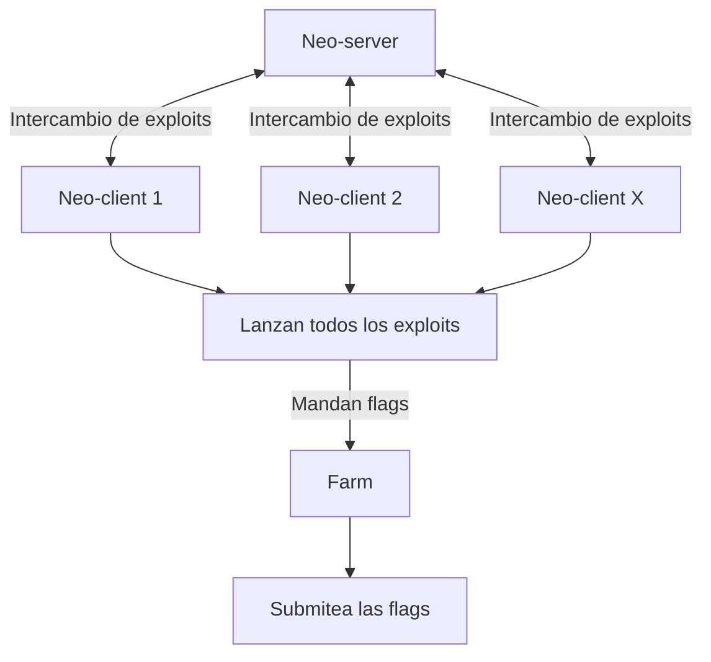

# Documentación AD - Attack/Defense CTF

## Esquema de Infraestructura

## Documentación
- [Despliegue de la Infraestructura](./infra_ad.md)
- [Configuración de la infra por CTF](ctf_setup.md)
- [Configuración de Cliente](./client_setup.md)
- [Desarrollo de exploits](exploit_guide.md)
> **Importante**: todos debeis leeros la configuracion del cliente, saber como trabajar con el neo, desarrollar exploits...

## Servicios
- **IP servidor en la VPN**: `10.0.0.1`
- **IP Servidor**: `10.0.0.1`
- **Clientes**: `10.0.1.X/32`
- **Haduhana**: `http://10.0.0.1:8000/`
- **Farm**: `http://10.0.0.1:5137/`
- **Grafana Dashboard**: `http://10.0.0.1:3000/`
- **Neo Exploits**: `http://10.0.0.1:5005/`
